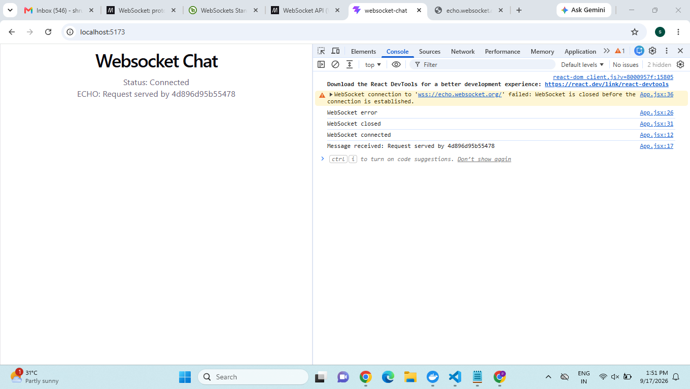
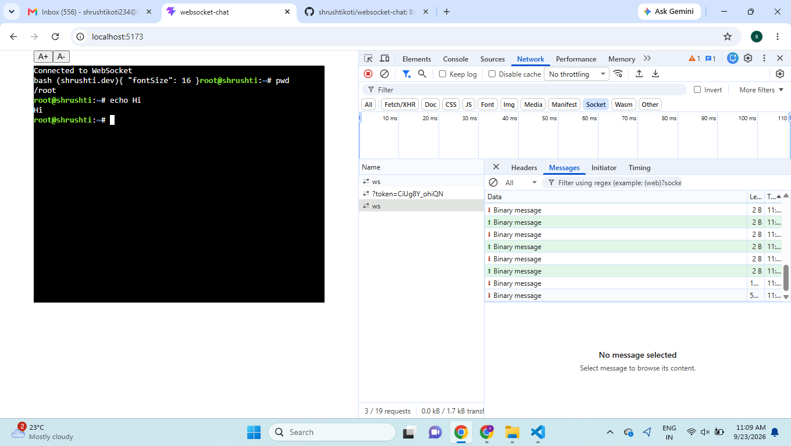

<!-- # WebSocket Chat

This is a basic React application that connects to 'wss://echo.websocket.org' using the native WebSocket API.

When the page loads, it creates a websocket connection with the server. once the connection is open, messages can be sent to the server the server echos the message back, and the received message is displayed on the page.

The application also shows the current connection status and handles different websocket states such as CONNECTING, OPEN, CLOSING, and CLOSED.

# Technologies used

- React
- Javascript
- Native Websocket API
- Vite

# How to Run 

Install the dependies 

'```npm install```

 -->

# WebSocket Terminal

A basic React application that connects to a WebSocket server and provides a terminal interface using xterm.js.

## Features

- Connects to the WebSocket terminal server
- Uses xterm.js for the terminal UI
- Sends terminal commands through WebSocket
- Displays server responses in the terminal
- Handles WebSocket connection states and errors
- A+ and A- buttons to change terminal font size

## Technologies

- React
- JavaScript
- xterm.js
- Native WebSocket API
- Vite

## How to Run

```bash
npm install
npm run dev

```
